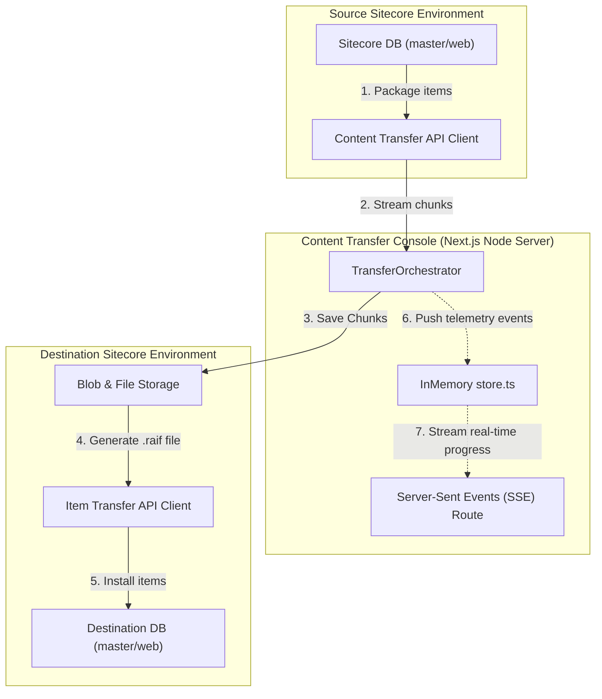

# Sitecore Content Transfer Console

The **Sitecore Content Transfer Console** is a modern, responsive Next.js application designed to orchestrate, monitor, and troubleshoot content migrations between **SitecoreAI** environments. It interfaces with the newly introduced **Content Transfer API** and **Item Transfer API** to deliver a unified, interactive migration control center.

---

## 🏗️ Architecture & Migration Workflow

The migration process works by chunking, encrypting, and compressing content from the source environment into `.raif` packages, streaming them to the destination, and invoking the destination's installation/consumption engine.



### High-Level Stage Execution

1. **Initialization:** The orchestrator authenticates with the Source and Destination using JWTs.
2. **Packaging:** A Content Transfer operation is created at the source for specified paths (e.g. `/sitecore/content/Home`).
3. **Data Streaming:** Telemetry chunks are pulled sequentially from the source environment and piped/uploaded to the destination.
4. **Reconstruction:** Chunks are compiled into `.raif` transfer files on the destination filesystem or blob store.
5. **Consumption:** The destination's Item Transfer API is triggered to parse the `.raif` package and install the items into the target database.

---

## 🚀 Getting Started

### Prerequisites

- **Node.js** (v18.0.0 or higher recommended)
- **npm** (v9.0.0 or higher)

### Installation

1. Install dependencies from the project root:
   ```bash
   npm install
   ```

2. Start the local development server:
   ```bash
   npm run dev
   ```
   The site will be available at [http://localhost:3000](http://localhost:3000).

3. To build the production bundle:
   ```bash
   npm run build
   npm run start
   ```

---

## ⚙️ Configuration & Environment Variables

Create a file named `.env.local` in the project root to configure credentials. By default, hostnames containing `mock` or `local` will trigger the built-in **Offline Simulation Mode** for local testing without querying live Sitecore endpoints.

| Environment Variable | Description | Default / Example |
|----------------------|-------------|-------------------|
| `SCT_SOURCE_HOST` | Hostname of the Source Authoring environment. | `source.mock` (Mock mode) |
| `SCT_SOURCE_CLIENT_ID` | OAuth Client ID for the source environment. | `mock-source-client-id` |
| `SCT_SOURCE_CLIENT_SECRET` | OAuth Client Secret for the source environment. | `mock-source-client-secret` |
| `SCT_DEST_HOST` | Hostname of the Destination Authoring environment. | `dest.mock` (Mock mode) |
| `SCT_DEST_CLIENT_ID` | OAuth Client ID for the destination environment. | `mock-dest-client-id` |
| `SCT_DEST_CLIENT_SECRET` | OAuth Client Secret for the destination environment. | `mock-dest-client-secret` |

> [!NOTE]
> Environment variables can be inspected live inside the web console under the **Environment Settings** tab. Credentials can also be configured dynamically at runtime using a [config.local.json](file:///d:/Antigravity/Sitecore%20Content%20Transfer/config.local.json) file.

---

## 📂 Codebase Structure

The console is organized into standard Next.js folders:

- [package.json](file:///d:/Antigravity/Sitecore%20Content%20Transfer/package.json): Lists application dependencies (`next`, `react`, `lucide-react`, etc.).
- [app](file:///d:/Antigravity/Sitecore%20Content%20Transfer/app): Application page routes and Next.js routing structure.
  - [globals.css](file:///d:/Antigravity/Sitecore%20Content%20Transfer/app/globals.css): Tailwind and global custom CSS variables.
  - [layout.tsx](file:///d:/Antigravity/Sitecore%20Content%20Transfer/app/layout.tsx): Sidebar navigation layover, global page structures, and Lucide Icon configurations.
  - [page.tsx](file:///d:/Antigravity/Sitecore%20Content%20Transfer/app/page.tsx): The primary Overview Dashboard showing migration run counters and active pipelines.
  - **Routes:**
    - [/transfer/new](file:///d:/Antigravity/Sitecore%20Content%20Transfer/app/transfer/new/page.tsx): Multi-step setup form for defining data trees, scope, and merge strategies.
    - [/transfer/[id]](file:///d:/Antigravity/Sitecore%20Content%20Transfer/app/transfer/%5Bid%5D/page.tsx): Live progress tracking dashboard with an interactive terminal feed utilizing SSE.
    - [/sources](file:///d:/Antigravity/Sitecore%20Content%20Transfer/app/sources/page.tsx): Interface for browsing packages, blob/file sources, and triggering direct manual consumptions.
    - [/history](file:///d:/Antigravity/Sitecore%20Content%20Transfer/app/history/page.tsx): Comprehensive historical audit logs of previous migration operations.
    - [/settings](file:///d:/Antigravity/Sitecore%20Content%20Transfer/app/settings/page.tsx): Credentials read-only panel.
  - **API Routes:**
    - [/api/settings](file:///d:/Antigravity/Sitecore%20Content%20Transfer/app/api/settings/route.ts): Exposes configured environment hosts and IDs.
    - [/api/transfer](file:///d:/Antigravity/Sitecore%20Content%20Transfer/app/api/transfer/route.ts): Handles starting new migrations and streaming real-time event logs using SSE.
    - [/api/destination](file:///d:/Antigravity/Sitecore%20Content%20Transfer/app/api/destination/route.ts): Wraps Item Transfer operations (sources, transfers, history, retries).
- [lib](file:///d:/Antigravity/Sitecore%20Content%20Transfer/lib): Core orchestration engine and API wrappers.
  - [auth.ts](file:///d:/Antigravity/Sitecore%20Content%20Transfer/lib/auth.ts): Handles OAuth client credential flow and caching for JWT tokens.
  - [clients.ts](file:///d:/Antigravity/Sitecore%20Content%20Transfer/lib/clients.ts): Implementation of Sitecore API endpoints for Content Transfer and Item Transfer.
  - [orchestrator.ts](file:///d:/Antigravity/Sitecore%20Content%20Transfer/lib/orchestrator.ts): Contains [TransferOrchestrator](file:///d:/Antigravity/Sitecore%20Content%20Transfer/lib/orchestrator.ts#L13) which runs chunk downloads/uploads, monitors status, and broadcasts pipeline events.
  - [store.ts](file:///d:/Antigravity/Sitecore%20Content%20Transfer/lib/store.ts): Houses in-memory state stores for mock histories and active pipelines.
  - [types.ts](file:///d:/Antigravity/Sitecore%20Content%20Transfer/lib/types.ts): TypeScript type interfaces, states, and error structures.
- [context](file:///d:/Antigravity/Sitecore%20Content%20Transfer/context):
  - [api-guide.md](file:///d:/Antigravity/Sitecore%20Content%20Transfer/context/api-guide.md): The official documentation for Sitecore Content Transfer API and Item Transfer API integrations.
  - [content-transfer-api.openapi.json](file:///d:/Antigravity/Sitecore%20Content%20Transfer/context/content-transfer-api.openapi.json): OpenAPI specification for the integration endpoint routes.

---

## 🛠️ API Reference Summary

The application consumes two primary API endpoints from SitecoreAI:

### 1. Content Transfer API (Source)

- **Create a Content Transfer Operation:** `POST /sitecore/api/content/transfer/v1/transfers`
- **Check Packaging Status:** `GET /sitecore/api/content/transfer/v1/transfers/{transferId}/status`
- **Retrieve Chunk Data:** `GET /sitecore/api/content/transfer/v1/transfers/{transferId}/chunks/{chunkId}`
- **Complete/Assemble Chunk Sets:** `POST /sitecore/api/content/transfer/v1/transfers/{transferId}/chunks/complete`
- **Cleanup Operation:** `DELETE /sitecore/api/content/transfer/v1/transfers/{transferId}`

### 2. Item Transfer API (Destination)

- **Get Historical Consumptions:** `GET /sitecore/api/item/transfer/v1/history`
- **List Available `.raif` Packages:** `GET /sitecore/api/item/transfer/v1/sources`
- **Install (Consume) Package:** `POST /sitecore/api/item/transfer/v1/consume`
- **Monitor Import Status:** `GET /sitecore/api/item/transfer/v1/transfers/{id}`
- **Retry Failed Imports:** `POST /sitecore/api/item/transfer/v1/retry`

For a detailed walkthrough, sample payloads, and payload attributes, refer to the [api-guide.md](file:///d:/Antigravity/Sitecore%20Content%20Transfer/context/api-guide.md) context file.

---

## 🛡️ License

Private internal migration tool. Distributed under the SitecoreAI enterprise developer guidelines.
