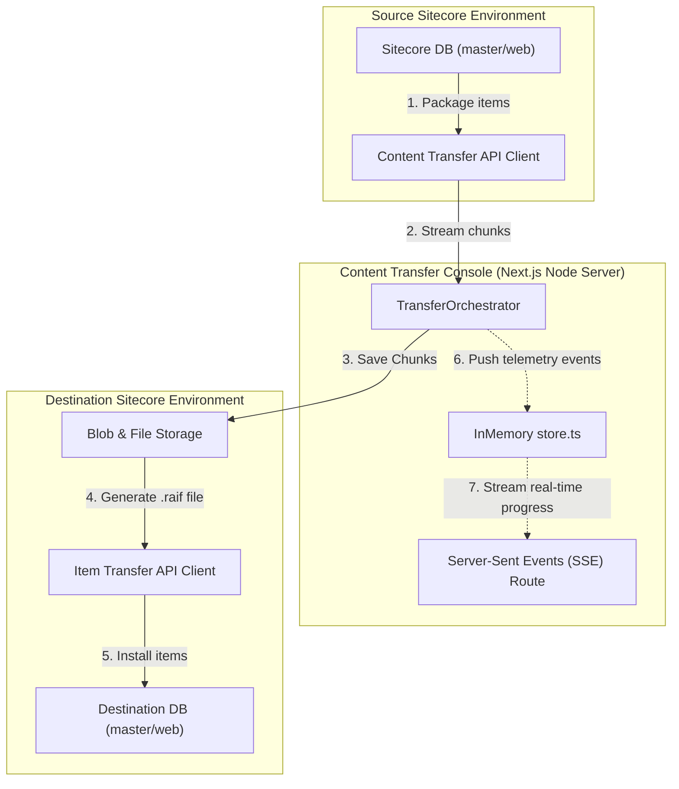
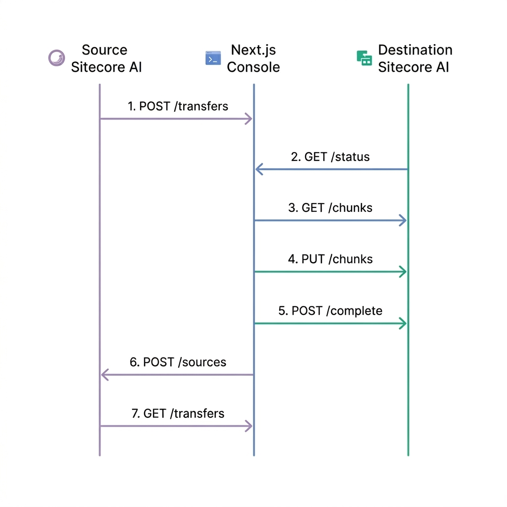

# Sitecore Content Transfer Console

The **Sitecore Content Transfer Console** is a modern, responsive Next.js application designed to orchestrate, monitor, and troubleshoot content migrations between **SitecoreAI** environments. It interfaces with the newly introduced **Content Transfer API** and **Item Transfer API** to deliver a unified, interactive migration control center.

---

## 🏗️ Architecture & Migration Workflow

The migration process works by chunking, encrypting, and compressing content from the source environment into `.raif` packages, streaming them to the destination, and invoking the destination's installation/consumption engine.





### High-Level Stage Execution

1. **Initialization:** The orchestrator authenticates with the Source and Destination Sitecore AI environments using JWTs.
2. **Packaging:** A Content Transfer operation is created at the source for specified paths (e.g. `/sitecore/content/Home`).
3. **Data Streaming:** Telemetry chunks are pulled sequentially from the source environment and piped/uploaded to the destination.
4. **Reconstruction:** Chunks are compiled into `.raif` transfer files on the destination filesystem or blob store.
5. **Consumption:** The destination's Item Transfer API is triggered to parse the `.raif` package and install the items into the target database.

---

## 🛡️ Security Gatekeepers & Isolation

To protect live customer environments and prevent accidental database updates, the console implements multiple layers of authorization and verification:

### 1. Production Isolation & Risk Warning
* **Risk Warnings**: Triggering any operation or loading a view targeting a `Production` environment warns the user with a distinct prompt highlighting the potential load on authoring servers.
* **Standard vs. Admin Verification**: Dev, QA, and UAT workloads require a standard password key (`SCT_STANDARD_PASSWORD`). All operations targeting Production require an elevated administrative password key (`SCT_ADMIN_PASSWORD`).

### 2. Client-Side Check-and-Block Validation
* Upon changing host targets to Production or loading a production route, a verification modal intercepts the user to request the environment key.
* The frontend immediately executes a validation dry-run with the backend console. If successful, the verified key is stored in React memory and added to the `x-auth-password` header for subsequent transactions (Consuming, Deleting, Retrying). If validation fails, dashboard rendering is blocked.

### 3. Server-Sent Events (SSE) & Polling Fallback
* Live migrations stream real-time events through an SSE connection (`/api/transfer?sse=true`).
* If a corporate firewall or proxy blocks persistent SSE streams, the console automatically switches to an optimized `1.5s` polling loop fallback, ensuring uninterrupted state monitoring.

---

## 🚀 Getting Started

### Prerequisites

- **Node.js** (v18.0.0 or higher recommended)
- **npm** (v9.0.0 or higher)

### Installation

1. Install dependencies from the project root:
   ```bash
   npm install
   ```

2. Start the local development server:
   ```bash
   npm run dev
   ```
   The site will be available at [http://localhost:3000](http://localhost:3000).

3. To build the production bundle:
   ```bash
   npm run build
   npm run start
   ```

---

## ⚙️ Configuration & Environment Variables

Create a file named `.env.local` in the project root to configure credentials. By default, hostnames containing `mock` or `local` will trigger the built-in **Offline Simulation Mode** for local testing without querying live Sitecore endpoints.

| Environment Variable | Description | Default / Example |
|----------------------|-------------|-------------------|
| `SCT_DEV_HOST` | Hostname of the Development Sitecore AI environment. | `xmc-source.mock` (Mock mode) |
| `SCT_DEV_CLIENT_ID` | OAuth Client ID for the Dev environment. | `mock-source-client-id` |
| `SCT_DEV_CLIENT_SECRET` | OAuth Client Secret for the Dev environment. | `mock-source-client-secret` |
| `SCT_QA_HOST` | Hostname of the QA Sitecore AI environment. | `xmc-dest.mock` (Mock mode) |
| `SCT_QA_CLIENT_ID` | OAuth Client ID for the QA environment. | `mock-dest-client-id` |
| `SCT_QA_CLIENT_SECRET` | OAuth Client Secret for the QA environment. | `mock-dest-client-secret` |
| `SCT_UAT_HOST` | Hostname of the UAT Sitecore AI environment. | `uat.mock` (Mock mode) |
| `SCT_UAT_CLIENT_ID` | OAuth Client ID for the UAT environment. | `mock-uat-client-id` |
| `SCT_UAT_CLIENT_SECRET` | OAuth Client Secret for the UAT environment. | `mock-uat-client-secret` |
| `SCT_PRODUCTION_HOST` | Hostname of the Production Sitecore AI environment. | `production.mock` (Mock mode) |
| `SCT_PRODUCTION_CLIENT_ID` | OAuth Client ID for the Production environment. | `mock-production-client-id` |
| `SCT_PRODUCTION_CLIENT_SECRET` | OAuth Client Secret for the Production environment. | `mock-production-client-secret` |
| `SCT_ADMIN_PASSWORD` | Elevated security verification password for Production operations. | `admin` |
| `SCT_STANDARD_PASSWORD` | Standard security verification password for Dev, QA, and UAT operations. | `admin` |

> [!NOTE]
> Environment variables can be inspected live inside the web console under the **Environment Settings** tab. Credentials can also be configured dynamically at runtime using a [config.local.json](file:///d:/Antigravity/Sitecore%20Content%20Transfer/config.local.json) file.

---

## 📂 Codebase Structure

The console is organized into standard Next.js folders:

- [package.json](file:///d:/Antigravity/Sitecore%20Content%20Transfer/package.json): Lists application dependencies (`next`, `react`, `lucide-react`, etc.).
- [app](file:///d:/Antigravity/Sitecore%20Content%20Transfer/app): Application page routes and Next.js routing structure.
  - [globals.css](file:///d:/Antigravity/Sitecore%20Content%20Transfer/app/globals.css): Tailwind and global custom CSS variables.
  - [layout.tsx](file:///d:/Antigravity/Sitecore%20Content%20Transfer/app/layout.tsx): Sidebar navigation layover, global page structures, and Lucide Icon configurations.
  - [page.tsx](file:///d:/Antigravity/Sitecore%20Content%20Transfer/app/page.tsx): The primary Overview Dashboard showing migration run counters and active pipelines.
  - **Routes:**
    - [/transfer/new](file:///d:/Antigravity/Sitecore%20Content%20Transfer/app/transfer/new/page.tsx): Multi-step setup form for defining data trees, scope, and merge strategies.
    - [/transfer/[id]](file:///d:/Antigravity/Sitecore%20Content%20Transfer/app/transfer/%5Bid%5D/page.tsx): Live progress tracking dashboard with an interactive terminal feed utilizing SSE.
    - [/sources](file:///d:/Antigravity/Sitecore%20Content%20Transfer/app/sources/page.tsx): Interface for browsing packages, blob/file sources, and triggering direct manual consumptions.
    - [/history](file:///d:/Antigravity/Sitecore%20Content%20Transfer/app/history/page.tsx): Comprehensive historical audit logs of previous migration operations.
    - [/settings](file:///d:/Antigravity/Sitecore%20Content%20Transfer/app/settings/page.tsx): Credentials read-only panel.
  - **API Routes:**
    - [/api/settings](file:///d:/Antigravity/Sitecore%20Content%20Transfer/app/api/settings/route.ts): Exposes configured environment hosts and IDs.
    - [/api/transfer](file:///d:/Antigravity/Sitecore%20Content%20Transfer/app/api/transfer/route.ts): Handles starting new migrations and streaming real-time event logs using SSE.
    - [/api/destination](file:///d:/Antigravity/Sitecore%20Content%20Transfer/app/api/destination/route.ts): Wraps Item Transfer operations (sources, transfers, history, retries).
- [lib](file:///d:/Antigravity/Sitecore%20Content%20Transfer/lib): Core orchestration engine and API wrappers.
  - [auth.ts](file:///d:/Antigravity/Sitecore%20Content%20Transfer/lib/auth.ts): Handles OAuth client credential flow and caching for JWT tokens.
  - [clients.ts](file:///d:/Antigravity/Sitecore%20Content%20Transfer/lib/clients.ts): Implementation of Sitecore API endpoints for Content Transfer and Item Transfer.
  - [orchestrator.ts](file:///d:/Antigravity/Sitecore%20Content%20Transfer/lib/orchestrator.ts): Contains [TransferOrchestrator](file:///d:/Antigravity/Sitecore%20Content%20Transfer/lib/orchestrator.ts#L13) which runs chunk downloads/uploads, monitors status, and broadcasts pipeline events.
  - [store.ts](file:///d:/Antigravity/Sitecore%20Content%20Transfer/lib/store.ts): Houses in-memory state stores for mock histories and active pipelines.
  - [types.ts](file:///d:/Antigravity/Sitecore%20Content%20Transfer/lib/types.ts): TypeScript type interfaces, states, and error structures.
- [context](file:///d:/Antigravity/Sitecore%20Content%20Transfer/context):
  - [api-guide.md](file:///d:/Antigravity/Sitecore%20Content%20Transfer/context/api-guide.md): The official documentation for Sitecore Content Transfer API and Item Transfer API integrations.
  - [content-transfer-api.openapi.json](file:///d:/Antigravity/Sitecore%20Content%20Transfer/context/content-transfer-api.openapi.json): OpenAPI specification for the integration endpoint routes.

---

## 🔌 API Reference & Data Contracts

To orchestrate the content pipeline, the Next.js console executes the following APIs sequentially.

### API Execution Sequence


---

### Phase 1: Sitecore Content Transfer API (Source Sitecore AI)

#### 1. Initiate Transfer Session (`POST`)
* **Endpoint**: `/sitecore/api/content/transfer/v1/transfers`
* **Parameters**:
  | Type | Parameter | Data Type | Required | Description |
  |---|---|---|---|---|
  | **Header** | `Authorization` | `string` | Yes | `Bearer <JWT_TOKEN>` for OAuth authorization |
  | **Header** | `Content-Type` | `string` | Yes | Must be `application/json` |
  | **Body** | `TransferId` | `string (UUID)` | Yes | Client-generated unique identifier for the transaction |
  | **Body** | `Configuration.Database` | `string` | Yes | Target Sitecore database, usually `master` or `web` |
  | **Body** | `Configuration.DataTrees` | `array` | Yes | List of content nodes to package |
  | **Body** | `Configuration.DataTrees[].ItemPath` | `string` | Yes | Absolute node path, e.g. `/sitecore/content/Home` |
  | **Body** | `Configuration.DataTrees[].Scope` | `string` | Yes | Scope: `SingleItem` or `ItemAndDescendants` |
  | **Body** | `Configuration.DataTrees[].MergeStrategy` | `string` | Yes | Conflict mode: `OverrideExistingItem` or `KeepExistingItem` |
* **Request Payload**:
```json
{
  "Configuration": {
    "DataTrees": [
      {
        "ItemPath": "/sitecore/content/Home",
        "Scope": "ItemAndDescendants",
        "MergeStrategy": "OverrideExistingItem"
      }
    ],
    "Database": "master"
  },
  "TransferId": "f3b07384-d113-4c4f-9c03-51828f74d75b"
}
```
* **Response**: `202 Accepted`

#### 2. Get Chunk Assembly Status (`GET`)
* **Endpoint**: `/sitecore/api/content/transfer/v1/transfers/{transferId}/status`
* **Parameters**:
  | Type | Parameter | Data Type | Required | Description |
  |---|---|---|---|---|
  | **Path** | `transferId` | `string (UUID)` | Yes | The ID of the initiated transfer operation |
* **Response Payload**:
```json
{
  "State": "Completed",
  "ChunkSetsMetadata": [
    {
      "ChunkSetId": "cba98765-4321-4321-4321-876543210123",
      "ChunkCount": 5,
      "TotalItemCount": 120
    }
  ]
}
```

#### 3. Stream Binary Chunk (`GET`)
* **Endpoint**: `/sitecore/api/content/transfer/v1/transfers/{transferId}/chunksets/{chunksetId}/chunks/{chunkId}`
* **Parameters**:
  | Type | Parameter | Data Type | Required | Description |
  |---|---|---|---|---|
  | **Path** | `transferId` | `string (UUID)` | Yes | The ID of the current transfer operation |
  | **Path** | `chunksetId` | `string (UUID)` | Yes | The ID of the target chunk set |
  | **Path** | `chunkId` | `number` | Yes | Sequential numerical index of the chunk (`0` to `N-1`) |
  | **Header** | `Accept` | `string` | Yes | Must be `application/octet-stream` |
* **Response**: Raw binary data chunk. Key metadata is extracted from response headers (`ItemsProcessed`, `ItemsSkipped`, `IsMedia`).

#### 4. Complete Chunkset (`POST`)
* **Endpoint**: `/sitecore/api/content/transfer/v1/transfers/{transferId}/chunksets/{chunksetId}/complete`
* **Parameters**:
  | Type | Parameter | Data Type | Required | Description |
  |---|---|---|---|---|
  | **Path** | `transferId` | `string (UUID)` | Yes | The ID of the transfer operation |
  | **Path** | `chunksetId` | `string (UUID)` | Yes | The ID of the compiled chunk set |
* **Response**:
```json
{
  "ContentTransferFileName": "export_home_2026.raif"
}
```

---

### Phase 2: Sitecore Item Transfer API (Destination Sitecore AI)

#### 1. List Available Sources (`GET`)
* **Endpoints**: 
  * `/sources/blobs?page=1&pageSize=50` (Azure Blob container)
  * `/sources/files?page=1&pageSize=50` (CMS local filesystem)
* **Parameters**:
  | Type | Parameter | Data Type | Required | Description |
  |---|---|---|---|---|
  | **Query** | `page` | `number` | No | Page number for pagination (defaults to `1`) |
  | **Query** | `pageSize` | `number` | No | Number of records per page (defaults to `50`) |
* **Response Payload**:
```json
{
  "Page": 1,
  "PageSize": 50,
  "TotalCount": 1,
  "Sources": [
    {
      "Name": "export_home_2026.raif",
      "Size": 15204352,
      "BlobState": "Transferred"
    }
  ]
}
```

#### 2. Trigger Database Ingestion (`POST`)
* **Endpoint**: `/transfers/databases/{databaseName}/sources`
* **Parameters**:
  | Type | Parameter | Data Type | Required | Description |
  |---|---|---|---|---|
  | **Path** | `databaseName` | `string` | Yes | Target database to ingest items, e.g., `master` or `web` |
  | **Query** | `blobName` | `string` | No* | Name of the file inside Blob Storage (Required if `fileName` omitted) |
  | **Query** | `fileName` | `string` | No* | Name of the file inside Filesystem (Required if `blobName` omitted) |
  | **Header** | `Authorization` | `string` | Yes | `Bearer <JWT_TOKEN>` for OAuth authorization |
* **Response**: `202 Accepted` (includes `Location` header to poll progress).

#### 3. Query Ingestion Details (`GET`)
* **Endpoint**: `/transfers/{transferId}`
* **Parameters**:
  | Type | Parameter | Data Type | Required | Description |
  |---|---|---|---|---|
  | **Path** | `transferId` | `string` | Yes | The ID of the ingestion operation (returned in headers/history) |
* **Response Payload**:
```json
{
  "Id": "hist.ingest.export2026",
  "SourceName": "export_home_2026.raif",
  "DatabaseName": "master",
  "State": "Finished",
  "TotalItems": 120,
  "ProcessedItems": 120,
  "SkippedItems": 0,
  "FailedItems": 0,
  "Errors": [],
  "Warnings": []
}
```

For a detailed walkthrough, sample payloads, and payload attributes, refer to the [api-guide.md](context/api-guide.md) context file.

---

## 🛡️ License

Private internal migration tool. Distributed under the SitecoreAI enterprise developer guidelines.
