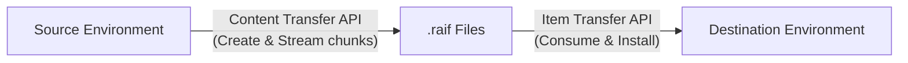
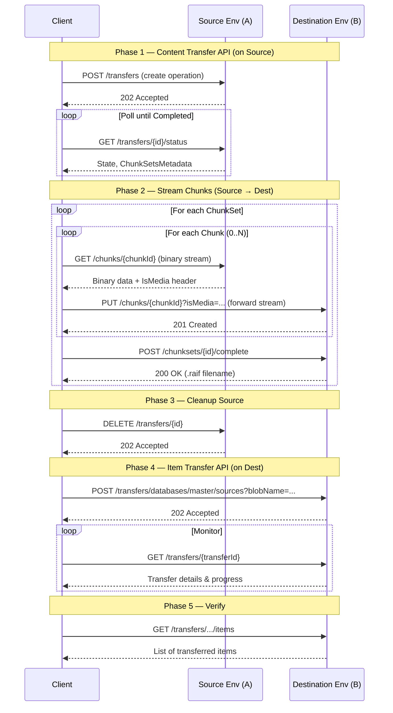

# Sitecore Content Transfer API & Item Transfer API — Complete Guide

> [!NOTE]
> Released **July 1, 2026** as a new feature for **SitecoreAI**. These two APIs work together as a single migration workflow for transferring content between Sitecore environments.

---

## Overview

The **Content Transfer API** and **Item Transfer API** provide an end-to-end workflow for migrating content between SitecoreAI environments (source → destination). The process uses **chunked data streaming** with encryption and compression support.



### High-Level Workflow

| Step | API | What Happens |
|------|-----|-------------|
| 1. Create transfer operation | Content Transfer | Specify items/paths to transfer, creates chunk sets |
| 2. Monitor operation | Content Transfer | Poll status until `Completed` |
| 3. Transfer data chunks | Content Transfer | GET each chunk from source, PUT to destination |
| 4. Complete chunk sets | Content Transfer | Generates `.raif` files on destination |
| 5. Cleanup | Content Transfer | Delete transfer operation & resources |
| 6. Consume `.raif` files | Item Transfer | Install transferred content into destination DB |
| 7. Inspect & verify | Item Transfer | View transferred items, check history |

---

## Authentication (Same for Both APIs)

Both APIs use **JWT Bearer tokens** obtained via OAuth client credentials.

### 1. Create Automation Client
1. Open **SitecoreAI Deploy** in Sitecore Cloud Portal
2. Go to **Credentials** > **Environment** > **Create credentials** > **Automation**
3. Save the **client ID** and **client secret**

### 2. Request a JWT

```bash
curl -X POST 'https://auth.sitecorecloud.io/oauth/token' \
  --header 'Content-Type: application/x-www-form-urlencoded' \
  --data-urlencode 'client_id={YOUR_CLIENT_ID}' \
  --data-urlencode 'client_secret={YOUR_CLIENT_SECRET}' \
  --data-urlencode 'grant_type=client_credentials' \
  --data-urlencode 'audience=https://api.sitecorecloud.io'
```

> [!TIP]
> The JWT expires in **24 hours**. Cache it to avoid repeated token requests.

### 3. Include JWT in All Requests

```bash
curl -X GET '{BASE_URL}/...' \
  -H 'Authorization: Bearer {YOUR_JWT}' \
  -H 'Accept: application/json'
```

---

## Content Transfer API

**Base URL:** `https://{host}` (where `{host}` = your environment host name, e.g., `cm.your-tenant.sitecorecloud.io`)

Find your host name in: **SitecoreAI Deploy** > **Projects** > your project > **Authoring environments** > your environment > **Details** > **Environment host name**

### Endpoints

#### 1. Create a Content Transfer Operation

| | |
|---|---|
| **Method** | `POST` |
| **Path** | `/sitecore/api/content/transfer/v1/transfers` |
| **Response** | `202 Accepted` |

Creates a new transfer operation. You specify item paths, scope (single item vs. with descendants), and merge strategy.

**Request Body:**
```json
{
  "Configuration": {
    "DataTrees": [
      {
        "ItemPath": "/sitecore/content/Home",
        "Scope": "ItemAndDescendants",
        "MergeStrategy": "OverrideExistingItem"
      },
      {
        "ItemPath": "/sitecore/media library/Images",
        "Scope": "SingleItem",
        "MergeStrategy": "KeepExistingItem"
      }
    ],
    "Database": "master"
  },
  "TransferId": "12345678-1234-1234-1234-123456789abc"
}
```

**Scope Values:**
| Value | Description |
|-------|-------------|
| `SingleItem` | Transfer only the specified item (default) |
| `ItemAndDescendants` | Transfer the item and all its descendants |

**Merge Strategy Values:**
| Value | Description |
|-------|-------------|
| `OverrideExistingItem` | Replace duplicates in destination (default) |
| `KeepExistingItem` | Keep existing items, skip duplicates |
| `LatestWin` | Keep whichever version is most recent |
| `OverrideExistingTree` | Replace the entire tree in destination |

> [!WARNING]
> If you reuse a previous `TransferId`, the previous transfer operation will be **overwritten** (if not already deleted).

---

#### 2. Retrieve Transfer Operation Status

| | |
|---|---|
| **Method** | `GET` |
| **Path** | `/sitecore/api/content/transfer/v1/transfers/{transferId}/status` |
| **Response** | `200 OK` |

Returns the current state and chunk set metadata.

**Response Example:**
```json
{
  "State": "Completed",
  "ChunkSetsMetadata": [
    {
      "ChunkSetId": "87654321-4321-4321-4321-cba987654321",
      "ChunkCount": 3,
      "TotalItemCount": 150
    },
    {
      "ChunkSetId": "11223344-5566-7788-9900-aabbccddeeff",
      "ChunkCount": 1,
      "TotalItemCount": 25
    }
  ]
}
```

**State Values:** `Running` | `Completed` | `Failed` | `NotFound`

---

#### 3. Retrieve a Specific Data Chunk (from Source)

| | |
|---|---|
| **Method** | `GET` |
| **Path** | `/sitecore/api/content/transfer/v1/transfers/{transferId}/chunksets/{chunksetId}/chunks/{chunkId}` |
| **Response** | `200 OK` — binary stream |

Fetches a single chunk of serialized item data. The first chunk in each set includes a header.

- **Media data** (`IsMedia` = `true`) → compressed
- **Content data** (`IsMedia` = `false`) → encrypted

Metadata exposed via `Content-Disposition` header: `ItemsProcessed`, `ItemsSkipped`, `IsMedia`

---

#### 4. Save a Data Chunk (to Destination)

| | |
|---|---|
| **Method** | `PUT` |
| **Path** | `/sitecore/api/content/transfer/v1/transfers/{transferId}/chunksets/{chunksetId}/chunks/{chunkId}?isMedia={true\|false}` |
| **Response** | `201 Created` |

Saves the raw binary stream obtained from Step 3 to the destination environment.

> [!IMPORTANT]
> Forward the binary stream **exactly as received** — do NOT decompress, decrypt, re-encode, or modify it in any way.

---

#### 5. Complete a Chunk Set

| | |
|---|---|
| **Method** | `POST` |
| **Path** | `/sitecore/api/content/transfer/v1/transfers/{transferId}/chunksets/{chunksetId}/complete` |
| **Response** | `200 OK` |

Generates a `.raif` file on the destination environment containing the chunk set data.

**Response:**
```json
{
  "ContentTransferFileName": "content-transfer-12345678-1234-1234-1234-123456789abc.raif"
}
```

---

#### 6. Delete a Content Transfer Operation

| | |
|---|---|
| **Method** | `DELETE` |
| **Path** | `/sitecore/api/content/transfer/v1/transfers/{transferId}` |
| **Response** | `202 Accepted` |

Cleans up the transfer operation and all associated resources.

---

## Item Transfer API

**Base URL:** `https://{host}/sitecore/shell/api/v3/ItemsTransfer`

This API consumes the `.raif` files produced by the Content Transfer API and installs the content into the destination database.

### Endpoints

#### Transfers

| Method | Path | Summary |
|--------|------|---------|
| `GET` | `/transfers` | List all active/completed transfers (paginated) |
| `GET` | `/transfers/{transferId}` | Get detailed metrics for a specific transfer |
| `POST` | `/transfers/databases/{databaseName}/sources` | **Start consuming** a `.raif` file into a database |
| `PUT` | `/transfers/databases/{databaseName}/sources` | **Retry** a failed transfer |

##### Start Consuming a Source

```bash
# From file system:
POST /transfers/databases/master/sources?fileName=testFile.raif

# From Azure Blob Storage:
POST /transfers/databases/master/sources?blobName=content_2025-08-28.raif
```

Returns `202 Accepted` with a `Location` header to check transfer status.

---

#### Items

| Method | Path | Summary |
|--------|------|---------|
| `GET` | `/transfers/databases/{databaseName}/sources/{sourceName}/items` | List transferred items (paginated) |
| `GET` | `/transfers/databases/{databaseName}/sources/{sourceName}/items/{itemId}` | Get details of a specific transferred item |

---

#### Sources

| Method | Path | Summary |
|--------|------|---------|
| `GET` | `/sources/blobs` | List available blob sources (paginated) |
| `GET` | `/sources/blobs/{blobName}` | Get state of a specific blob source |
| `POST` | `/sources/blobs/{blobName}` | **Upload** a `.raif` blob directly (< 50 MB) |
| `DELETE` | `/sources/blobs/{blobName}` | Delete/discard a blob source |
| `GET` | `/sources/files` | List file sources on the CMS file system |

> [!TIP]
> For small `.raif` files (< 50 MB), you can upload directly via the Item Transfer API's upload endpoint. For large migrations, use the Content Transfer API's chunked streaming approach.

---

#### History

| Method | Path | Summary |
|--------|------|---------|
| `GET` | `/history` | Paginated history of all consumed sources (descending by date) |

---

## Complete End-to-End Workflow

Here's the full sequence to migrate content from **Environment A** (source) to **Environment B** (destination):



### Step-by-Step Summary

1. **Create transfer** — `POST` to Content Transfer API with item paths, scope, and merge strategy
2. **Poll status** — `GET` transfer status until `State: "Completed"`
3. **Stream chunks** — For each chunk set, for each chunk:
   - `GET` the chunk binary from source
   - `PUT` the identical binary to destination (preserve compression/encryption)
4. **Complete chunk sets** — `POST` to generate `.raif` files on destination
5. **Cleanup** — `DELETE` the transfer operation from source
6. **Consume** — Use Item Transfer API to `POST` and start consuming the `.raif` file into the destination database
7. **Monitor & Verify** — Check transfer status, list transferred items, inspect individual items
8. **Retry if needed** — `PUT` to retry any failed sources
9. **Review history** — `GET /history` for audit trail

---

## Key Concepts

| Concept | Description |
|---------|-------------|
| **Transfer Operation** | A logical unit representing the migration of one or more content trees |
| **Chunk Set** | A single data tree nominated for transfer; becomes one `.raif` file |
| **Chunk** | A piece of a chunk set; streamed individually for large data transfers |
| **`.raif` File** | The serialized transfer package format consumed by the Item Transfer API |
| **Source** | A `.raif` file available for consumption (from file system or Azure Blob) |
| **Merge Strategy** | How conflicts are resolved when items already exist in the destination |

## API Documentation Links

- [Content Transfer API](https://api-docs.sitecore.com/sai/content-transfer)
- [Item Transfer API](https://api-docs.sitecore.com/sai/item-transfer)
- [Changelog Announcement](https://developers.sitecore.com/changelog/sitecoreai/01072026/content-transfer-api-and-item-transfer-api-now-available)
